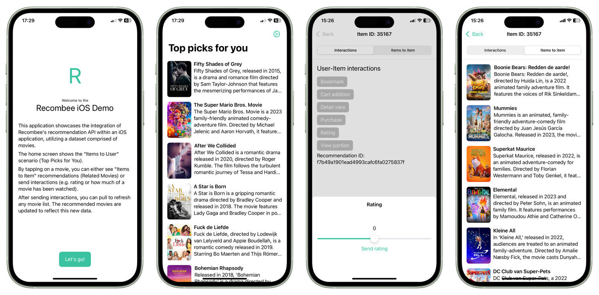

# Recombee iOS Demo

This application showcases the integration of [Recombee's](https://www.recombee.com/) recommendation
API within an iOS application, utilizing a dataset comprised of movies.
Specifically, it integrates the [Swift API client](https://github.com/recombee/swift-api-client).

The home screen shows the "Items to User" scenario (Top Picks for You).

By tapping on a movie, you can either see "Items to Item" recommendations (Related Movies) or send
interactions (e.g. rating or how much of a movie has been watched).

After sending interactions, you can pull to refresh any movie list. The recommended movies are
updated to reflect this new data.

## Screenshots

## How to build

1. Clone the repository
2. Open the project in Xcode
3. Change code-signing identity and bundle identifier
3. Build the project

You can then run the app on your device (physical or virtual).

## Code structure

This is build as SwiftUI app, following MVVM design pattern.

Both light and dark themes are supported.

For the entire application, a single `RecombeeClient` instance is created as singleton for simplicity.

These ViewModels fetch data from Recombee by means of the provided client.
The received data is then displayed in SwiftUI.

For the user ID, a random UUID is generated and stored using the @AppStorage macro, you can reset user ID in the in-app settings.
